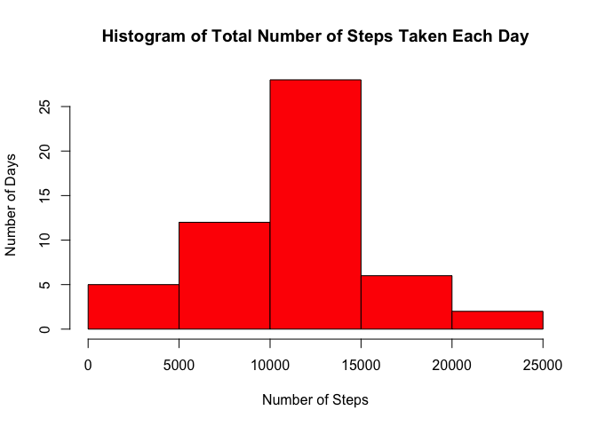
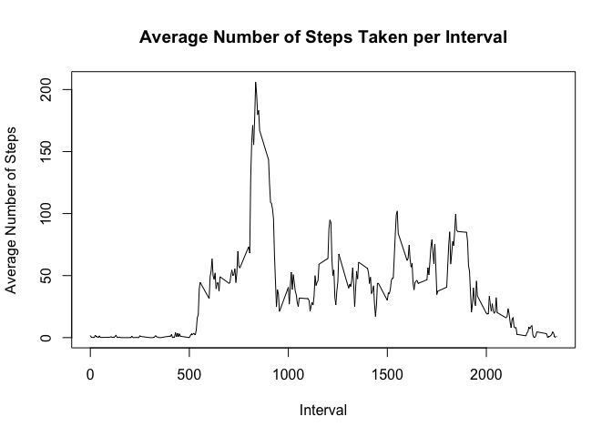
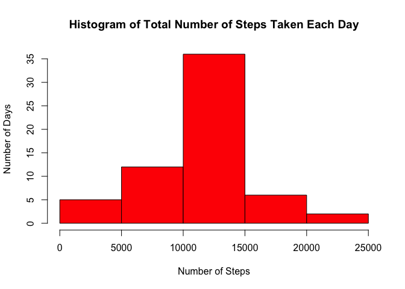
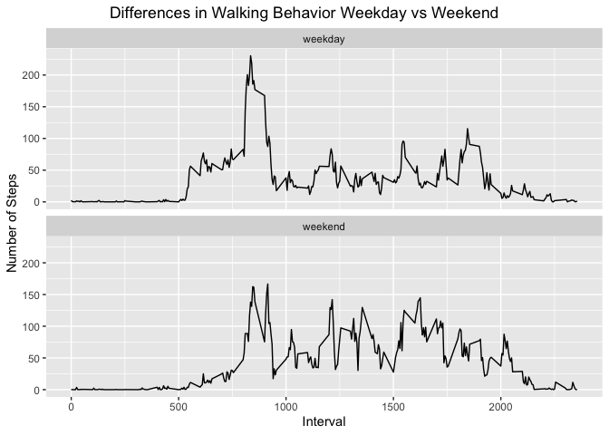

## Loading and preprocessing the data

### 1.  Load activity.csv from your current working directory and display the first few records:

```r
df <- read.csv("activity.csv")
head(df)
```

```
##   steps       date interval
## 1    NA 2012-10-01        0
## 2    NA 2012-10-01        5
## 3    NA 2012-10-01       10
## 4    NA 2012-10-01       15
## 5    NA 2012-10-01       20
## 6    NA 2012-10-01       25
```

### 2.  Perform any preprocessing of the data:

```r
# load any libraries needed
library(dplyr)
```

```
## 
## Attaching package: 'dplyr'
```

```
## The following objects are masked from 'package:stats':
## 
##     filter, lag
```

```
## The following objects are masked from 'package:base':
## 
##     intersect, setdiff, setequal, union
```

```r
library(ggplot2)
# create a separate df with all missing values removed
ccDF <- df[complete.cases(df),]
head(ccDF)
```

```
##     steps       date interval
## 289     0 2012-10-02        0
## 290     0 2012-10-02        5
## 291     0 2012-10-02       10
## 292     0 2012-10-02       15
## 293     0 2012-10-02       20
## 294     0 2012-10-02       25
```

## What is mean total number of steps taken per day?

### 1.  Make a histogram of the total number of steps taken each day:

```r
# group by date and get total number of steps
bydayDF <- ccDF %>% select("date", "steps") %>% group_by(date) %>% summarize(TotalSteps=sum(steps))
hist(bydayDF$TotalSteps, col="red", xlab = "Number of Steps", ylab = "Number of Days", 
     main = "Histogram of Total Number of Steps Taken Each Day")
```

<!-- -->

### 2.  Calculate and report the mean and median total number of steps taken per day:

```r
print("Mean and Median with NAs removed")
```

```
## [1] "Mean and Median with NAs removed"
```

```r
reportOriginalDF <- data.frame(mean = mean(bydayDF$TotalSteps), median = median(bydayDF$TotalSteps))
reportOriginalDF
```

```
##       mean median
## 1 10766.19  10765
```

## What is the average daily activity pattern?

### 1.  Make a time series plot (i.e. type = "l") of the 5-minute interval (x-axis) and the average number of steps taken, averaged across all days (y-axis)

```r
# group by date and get total number of steps
byintervalDF <- ccDF %>% select("interval", "steps") %>% group_by(interval) %>% summarize(AverageSteps=mean(steps))
plot(byintervalDF$interval, byintervalDF$AverageSteps, type = "l", xlab = "Interval",
     ylab = "Average Number of Steps", 
     main = "Average Number of Steps Taken per Interval")
```

<!-- -->

### 2.  Which 5-minute interval, on average across all the days in the dataset, contains the maximum number of steps?

```r
byintervalDF[which.max(byintervalDF$AverageSteps),]
```

```
## # A tibble: 1 x 2
##   interval AverageSteps
##      <int>        <dbl>
## 1      835         206.
```

## Imputing missing values
### 1.  Calculate and report the total number of missing values in the dataset (i.e. the total number of rows with NAs)

```r
sum(!complete.cases(df))
```

```
## [1] 2304
```

### 2.  Devise a strategy for filling in all of the missing values in the dataset. The strategy does not need to be sophisticated. For example, you could use the mean/median for that day, or the mean for that 5-minute interval, etc.

    The strategy used to impute missing values in the dataset will be the mean for that 5-minute interval across all days.

### 3.  Create a new dataset that is equal to the original dataset but with the missing data filled in.

```r
# first merge the original and mean dataframes 
imputedDF <- merge(df, byintervalDF, by = "interval")
# then populate the new adjustedsteps column with the results of the if-else clause
imputedDF$AdjustedSteps <- with(imputedDF, ifelse(is.na(steps), AverageSteps, steps))
print("Show AdjustedSteps on rows with NA steps")
```

```
## [1] "Show AdjustedSteps on rows with NA steps"
```

```r
head(imputedDF[is.na(imputedDF$steps), ])
```

```
##    interval steps       date AverageSteps AdjustedSteps
## 1         0    NA 2012-10-01     1.716981      1.716981
## 11        0    NA 2012-11-04     1.716981      1.716981
## 32        0    NA 2012-11-30     1.716981      1.716981
## 41        0    NA 2012-11-14     1.716981      1.716981
## 45        0    NA 2012-11-09     1.716981      1.716981
## 49        0    NA 2012-11-01     1.716981      1.716981
```

```r
print("Some AdjustedSteps on rows where steps > 0")
```

```
## [1] "Some AdjustedSteps on rows where steps > 0"
```

```r
head(imputedDF[is.na(imputedDF$steps) == 0 & imputedDF$steps > 0, ])
```

```
##     interval steps       date AverageSteps AdjustedSteps
## 16         0    47 2012-10-04    1.7169811            47
## 42         0    10 2012-10-22    1.7169811            10
## 43         0    34 2012-10-10    1.7169811            34
## 99         5    18 2012-10-10    0.3396226            18
## 179       10     7 2012-10-10    0.1320755             7
## 214       15     8 2012-10-11    0.1509434             8
```

### 4.  Make a histogram of the total number of steps taken each day and Calculate and report the mean and median total number of steps taken per day. Do these values differ from the estimates from the first part of the assignment? What is the impact of imputing missing data on the estimates of the total daily number of steps?

```r
# group by date and get total number of steps
bydayDF <- imputedDF %>% select("date", "AdjustedSteps") %>% group_by(date) %>% summarize(TotalSteps=sum(AdjustedSteps))
hist(bydayDF$TotalSteps, col="red",  xlab = "Number of Steps", ylab = "Number of Days", 
     main = "Histogram of Total Number of Steps Taken Each Day")
```

<!-- -->

```r
print("Mean and Median with Imputed Values for NA")
```

```
## [1] "Mean and Median with Imputed Values for NA"
```

```r
reportImputedDF <- data.frame(mean = mean(bydayDF$TotalSteps), median = median(bydayDF$TotalSteps))
reportImputedDF
```

```
##       mean   median
## 1 10766.19 10766.19
```
    The imputed mean and original mean are unchanged.   The imputed median is now the same as
    the imputed mean, and slightly higher than the original mean.   There were 8 days in
    the dataset that have NA results for every row and interval for those days.   The impute
    script essentially assigned the original mean to those dates with missing values, which
    explains why the overall mean hasn't changed.   The histogram now shows 8 additional days
    in the 10k-15k steps bucket.   One of these days also happens to be the median in the 
    dataset, which explains why the imputed mean and imputed median are the same.

## Are there differences in activity patterns between weekdays and weekends?

### 1.  Create a new factor variable in the dataset with two levels -- "weekday" and "weekend" indicating whether a given date is a weekday or weekend day.

```r
imputedDF$weekday = weekdays(as.Date(imputedDF$date))
imputedDF$weekdaytype <- as.factor(ifelse(imputedDF$weekday == "Sunday" | imputedDF$weekday == "Saturday", "weekend", "weekday"))
head(imputedDF)
```

```
##   interval steps       date AverageSteps AdjustedSteps  weekday weekdaytype
## 1        0    NA 2012-10-01     1.716981      1.716981   Monday     weekday
## 2        0     0 2012-11-23     1.716981      0.000000   Friday     weekday
## 3        0     0 2012-10-28     1.716981      0.000000   Sunday     weekend
## 4        0     0 2012-11-06     1.716981      0.000000  Tuesday     weekday
## 5        0     0 2012-11-24     1.716981      0.000000 Saturday     weekend
## 6        0     0 2012-11-15     1.716981      0.000000 Thursday     weekday
```

### 2.  Make a panel plot containing a time series plot (i.e. type = "l") of the 5-minute interval (x-axis) and the average number of steps taken, averaged across all weekday days or weekend days (y-axis).

```r
byweekdayDF <- imputedDF %>% select("interval", "AdjustedSteps", "weekdaytype") %>% group_by(weekdaytype, interval) %>% summarize(AverageSteps = mean(AdjustedSteps))
```

```
## `summarise()` has grouped output by 'weekdaytype'. You can override using the `.groups` argument.
```

```r
g <- ggplot(data = byweekdayDF, aes(x=interval, y=AverageSteps), facets = weekdaytype) + 
        geom_line() + 
        xlab("Interval") + 
        ylab("Number of Steps") + 
        ggtitle("Differences in Walking Behavior Weekday vs Weekend") + 
        facet_wrap(~weekdaytype, nrow = 2, ncol = 1) +
        theme(plot.title.position = "plot", plot.title = element_text(hjust=.5))
g
```

<!-- -->
